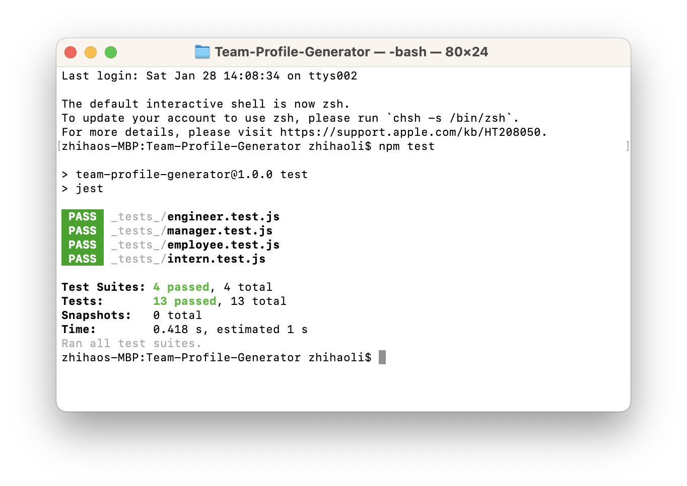
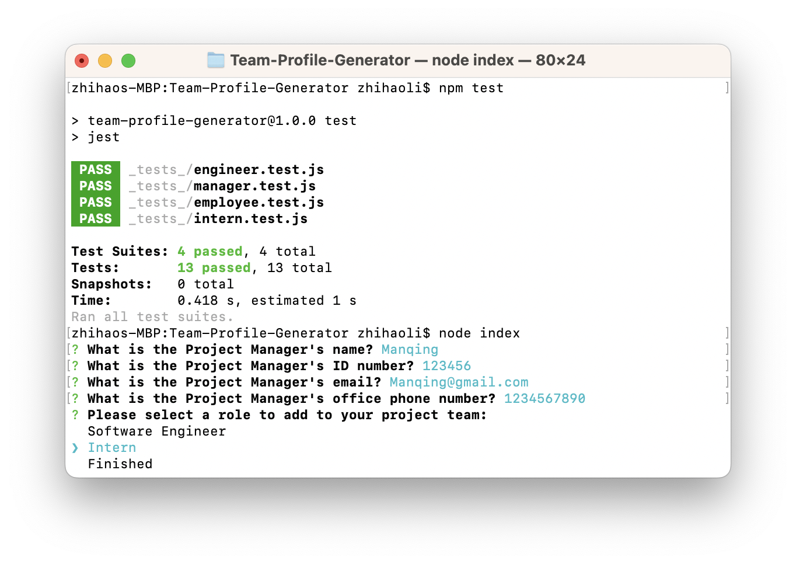
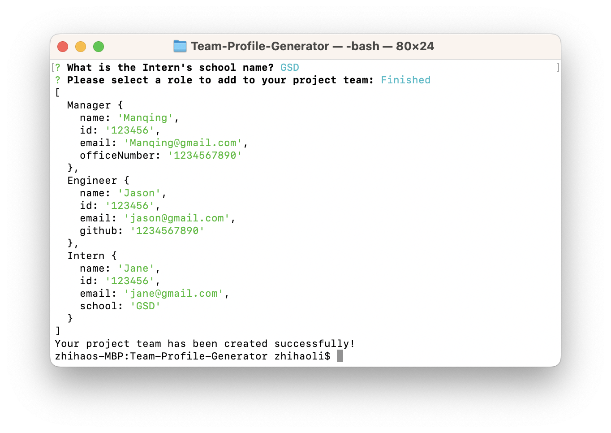
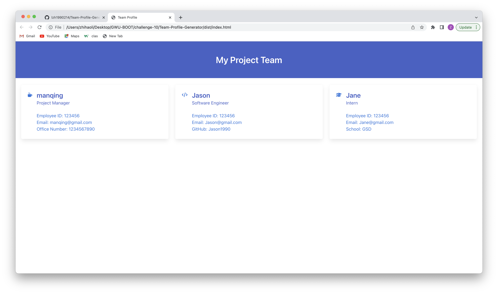
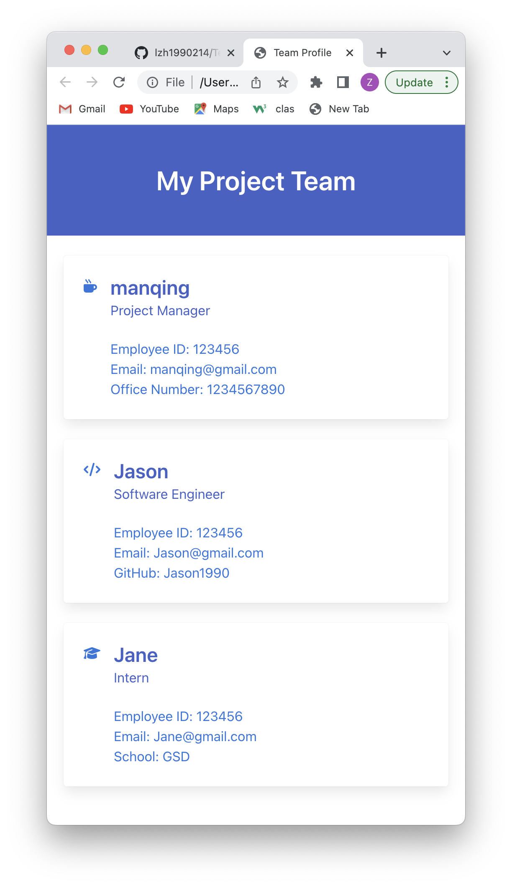

# Team-Profile-Generator

## Description
The project is to build a Node.js command-line application that takes in information about employees on a software engineering team, then generates an HTML webpage that displays summaries for each person. 

## Table of Contents
1. [Installation](#Installation)
2. [Usage](#Usage)
3. [Contributing](#Contributing)
4. [License](#License)
5. [Tests](#Tests)
6. [Questions](#Questions)
7. [Screenshots](#Screenshots)
8. [Walkthrough Video](#Walkthrough)

## Installation 
1. Install package.json with command `npm i`
2. Install Jest with command `npm install --save-dev jest`
2. Thie application will require the use of the `Inquirer` package, ensure that you install and use Inquirer version 8.2.4. Installation command is `npm i inquirer@8.2.4`

## Usage 
1. Opening an external ternimal from the repository
2. Run the application with command: `node index`
3. Answer all prompt questions and select 'finished' when done
4. Open the 'index.html' file in the 'dist' folder with a browser

## Contributing 

### Zhihao Li
https://github.com/lzh1990214/Team-Profile-Generator

### Jest
https://jestjs.io/

### Inquirer
https://www.npmjs.com/package/inquirer?activeTab=readme

## License 
UNLICENSED

## Tests 
1. Opening an external ternimal from the repository.
2. Run Jest command: `npm test`.

## Questions 

### Github
https://github.com/lzh1990214
### Email
zli02@alumni.risd.edu

## Screenshots 

### Jest test results

### Inquirer application

### Desktop Display

### Mobile Responsive Display

## Walkthrough Video 
https://www.youtube.com/watch?v=7i82DiKMiqg
